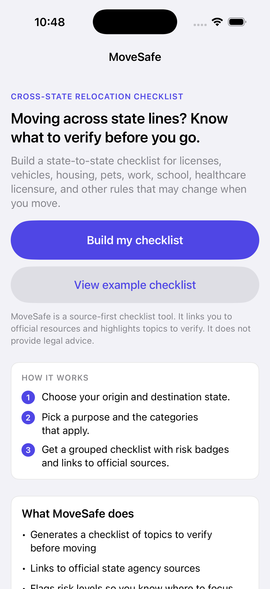
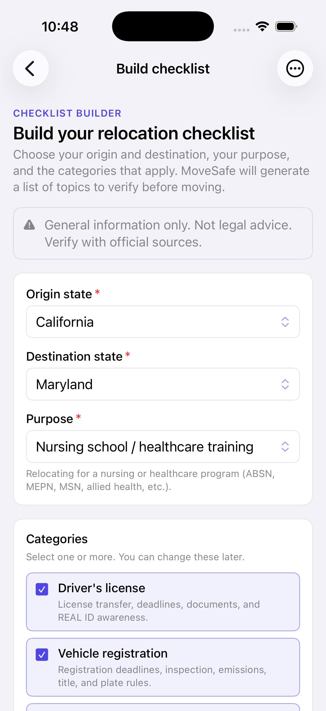
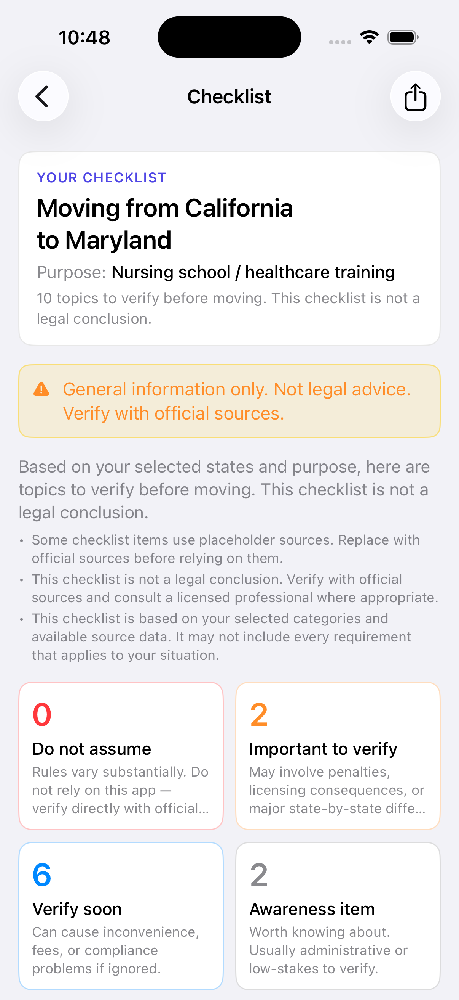
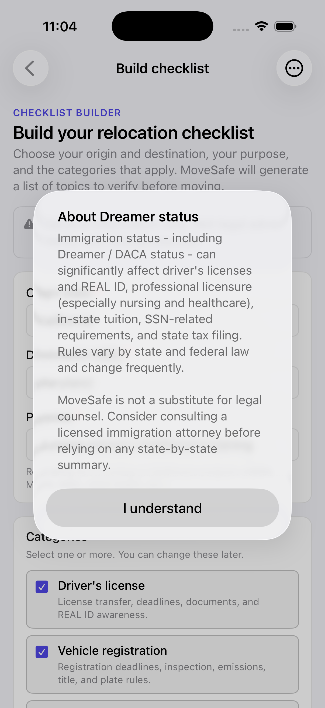
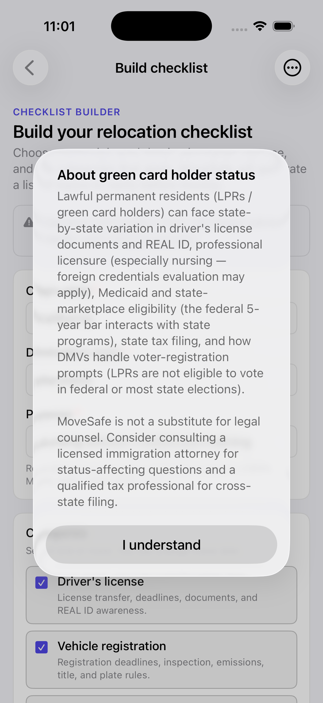
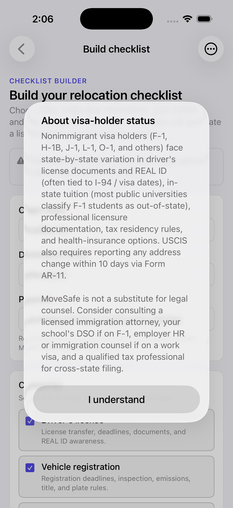
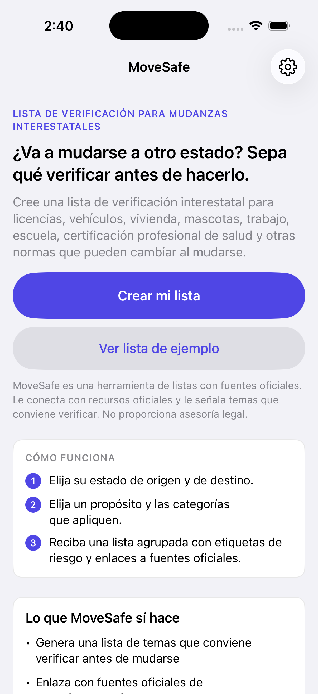
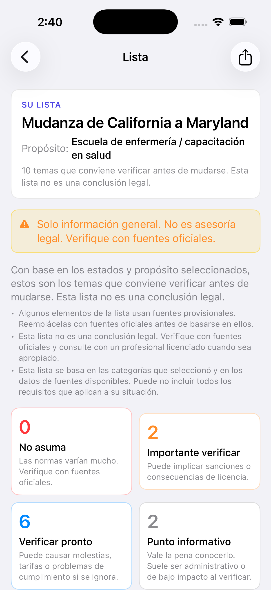
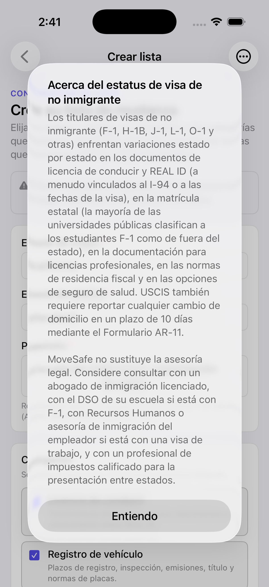

# MoveSafe

[](https://github.com/CuteSurtr/move_safe/actions/workflows/ios.yml)

A source-first, state-to-state relocation checklist for the United States - available as a web app (Vite + React) and a native iOS app (SwiftUI).

MoveSafe helps users understand what legal, administrative, licensing, and practical topics they should **verify** when moving across state lines, traveling, or temporarily staying in another state.

> MoveSafe is a general-information checklist and source-navigation tool. It is not a legal advice product and does not determine whether any specific conduct is lawful in any particular situation.

## Screenshots (iOS)

The example below is California → Maryland for nursing school.

<p align="center">
  
  
  
</p>

**Safety highlights - immigration-status acknowledgments.** When a user ticks "I'm a Dreamer (DACA / similar)", "I'm a green card holder (LPR)", or "I'm on a nonimmigrant visa (F-1, H-1B, J-1, etc.)" in the optional profile flags, MoveSafe immediately presents a status-specific alert reminding them that the affected areas (driver's licenses & REAL ID, professional licensure, in-state tuition / school residency, Medicaid and marketplace eligibility, state tax filing, voter-registration prompts at the DMV, USCIS AR-11 address reporting, SEVIS/DSO obligations for F-1 students, H-1B amendment triggers) vary by state and federal law - and that this platform is not a substitute for legal counsel. Each alert fires only on the false → true transition of its flag, so users who already acknowledged it don't get re-prompted on every launch.

<p align="center">
  
  
  
</p>

**Localization.** The iOS app ships with full translations of all 882 user-facing strings in seven languages, plus stub tables (English fallback) for 22 additional languages that are wired through the same runtime and can be filled in as translation work proceeds.

| Locale | Coverage | Settings label |
|---|---|---|
| English (en) | source | English |
| Spanish (es-419) | full | Español |
| Korean (ko) | full | 한국어 |
| Japanese (ja) | full | 日本語 |
| Simplified Chinese (zh-Hans) | full | 简体中文 |
| Traditional Chinese (zh-Hant) | full | 繁體中文 |
| Wu Chinese (wuu) | full, Wu vocab in Simplified script | 吴语 |
| Cantonese / Yue (yue) | full, Yue vocab in Simplified script | 粤语 |
| Hakka (hak) | full, Hakka vocab in Simplified script | 客家话 |
| Min Nan / Hokkien (nan) | full, Min Nan vocab in Simplified script | 闽南语 |
| Xiang Chinese (hsn) | full, Xiang vocab in Simplified script | 湘语 |
| German (de) | full | Deutsch |
| French (fr) | full | Français |
| Russian (ru) | full | Русский |
| Somali (so) | full | Soomaali |
| Tagalog, Vietnamese, Portuguese, Afrikaans, Farsi | stub tables (English fallback); picker exposes them, lookup falls back to English | shown in picker |

Coverage in a "full" locale spans every user-facing string: UI chrome, the 49 checklist items × 7 fields each, 92 source titles + agency names + notes, 13 categories, 10 purposes, all enum labels (RiskLevel, JurisdictionType, SourceType, SourceStatus, ProfileFlag), the four Disclaimers, the engine-generated warnings, and the share-sheet plain-text export. US state names stay in English (proper nouns / identifiers) and so do US-agency abbreviations (USCIS, IRS, SEVIS, REAL ID, DSO, OPT, LCA, etc.), consistent with how those terms appear on the official agency pages MoveSafe links to.

Language selection is auto-detected from the device locale (zh-Hans vs zh-Hant resolved by `Locale.script` with region fallback) and can be overridden in Settings (gear icon, top-right on Landing). Wu Chinese has no native iOS locale tag and is selected manually.

The safe-copy CI lint runs in every supported language with a per-language forbidden-cognate regex - so a translation that introduces "illegal" / "permitted" / "prohibited" / "guaranteed" / "avoid penalties" (or their cognates in any of the seven full-coverage languages) fails the build.

<p align="center">
  
  
  
</p>

## What MoveSafe is

- A relocation checklist
- A compliance preparation tool
- A source tracker
- A practical state-to-state moving guide
- A "things to verify before you move" dashboard

## What MoveSafe is not

- A legal chatbot
- A lawyer replacement
- A loophole finder
- An enforcement avoidance tool
- A tool that says "you are safe" or "this is definitely legal"

## Product safety philosophy

MoveSafe is intentionally structured to avoid drawing legal conclusions. Its core rules:

1. **No legal conclusions.** Items use language like "verify", "check", "rules may vary", and "do not assume." Items never say something is legal, illegal, allowed, or prohibited.
2. **No personalized legal advice.** The app does not take detailed facts about a user's situation and tell them whether a specific act is lawful.
3. **Source-first design.** Every checklist item is linked to an official source (or a clearly-labeled placeholder).
4. **Staleness warnings.** Sources are tagged with a `lastChecked` date and displayed with one of: Recently verified, Review recommended, Possibly outdated, Stale source, Placeholder source, Missing source.
5. **High-risk categories get "Do not assume" treatment.** For firearms, controlled substances, prescription transport, and similar categories, MoveSafe does not summarize rules - it only flags the topic for separate verification.
6. **No AI legal chatbot.** AI assistance is reserved for internal admin review tasks, not user-facing legal Q&A.
7. **Disclaimers are visible** on every page.

The full safe-copy rules are documented in [`src/lib/utils/safeCopy.ts`](src/lib/utils/safeCopy.ts) (web) and [`ios/Sources/MoveSafe/Utils/SafeCopy.swift`](ios/Sources/MoveSafe/Utils/SafeCopy.swift) (iOS). Any future content should follow them.

## Repository layout

```
/                       - Vite + React web app
  src/                  - Web source code
  index.html, package.json, vite.config.ts, ...
  README.md             - This file

ios/                    - Native SwiftUI iOS app
  README.md             - iOS-specific build instructions
  project.yml           - xcodegen config (the .xcodeproj is generated, not committed)
  Sources/MoveSafe/     - Swift source code
  research/             - Verified-URL JSON records
```

Both implementations share the same data model, safe-copy rules, and seed data. The iOS app additionally implements:

- Selection persistence to `UserDefaults` ("Continue my checklist" on Landing)
- Per-item completion tracking with a progress bar on Results
- iOS share sheet export of the checklist as plain text
- iOS-native filters, navigation, and dark mode

## Web app - run locally

```bash
npm install
npm run dev
```

Open the URL Vite prints (typically `http://localhost:5173`). Click **View example checklist** to skip the form and jump straight to a populated Results screen (California → Maryland for nursing school).

Other scripts:

- `npm run build` - type-check and build for production
- `npm run preview` - preview the production build
- `npm run lint` - TypeScript type check (no emit)

## iOS app - run locally

Requires macOS with Xcode 15+.

```bash
brew install xcodegen
cd ios
xcodegen generate
open MoveSafe.xcodeproj
```

In Xcode, pick an iPhone simulator and press **⌘R**. See [`ios/README.md`](ios/README.md) for more.

## State coverage

All 50 US states + DC are selectable. Each entry carries up to five verified agency URLs:

- official state homepage
- motor vehicle agency (DMV, BMV, MVD, Secretary of State, etc., depending on the state)
- tax agency
- attorney general / tenant resources
- board of nursing

**246 of 255 URL slots have been verified** against the live web (HEAD/GET on `.gov`/`.us`/official non-gov agency domains, redirects followed). The remaining 9 are documented placeholders - for example, Hawaii has no state-wide DMV because motor vehicle services are county-administered, and a handful of state nursing boards returned DNS errors on the verification run and need re-checking. The full research record, including per-placeholder reasons, is at [`ios/research/state_urls.json`](ios/research/state_urls.json).

Where the engine resolves a generic source (e.g. "Destination state board of nursing") against a state's actual URL, the source surfaces in the UI as **Recently verified** with a green badge; placeholders continue to show the dashed **Placeholder source** badge.

## Data model overview

Core types (web) live in [`src/lib/types.ts`](src/lib/types.ts); iOS mirrors them in [`ios/Sources/MoveSafe/Models/Models.swift`](ios/Sources/MoveSafe/Models/Models.swift).

- `State` (`USState` on iOS) - id, name, abbreviation, slug, agency URL fields
- `Purpose` - id, name, slug, description
- `Category` - id, name, slug, defaultRiskLevel, isHighRiskCategory, sortOrder
- `Source` - id, title, url, sourceType, jurisdictionType, lastChecked, status, isOfficial, notes, **stateUrlBinding** (iOS - resolves URL against the origin/destination state at engine time)
- `ChecklistItem` - id, title, categoryId, description, whyItMatters, whatToVerify, riskLevel, jurisdictionType, appliesToPurposes, appliesToProfileFlags, sourceIds, isHighRisk, …
- Enums: `RiskLevel`, `JurisdictionType`, `SourceType`, `SourceStatus`, `ProfileFlag`

## How to add a new checklist item

1. Open `src/lib/data/checklistItems.ts` (web) or `ios/Sources/MoveSafe/Data/ChecklistItems.swift` (iOS).
2. Add a new entry with all required fields (existing items are good templates).
3. Make sure the `categoryId` matches one of the IDs in the corresponding `categories` data file.
4. List which `appliesToPurposes` and `appliesToProfileFlags` make the item relevant. Items with empty `appliesToPurposes` show for every purpose.
5. Link source IDs via `sourceIds` (define new sources first).
6. **Use safe-copy language only.** Avoid "legal", "illegal", "allowed", "permitted", "prohibited", "you can", "you cannot", "safe to do X". Use "verify", "check", "may vary", "rules differ", "do not assume".
7. For categories like firearms, cannabis, alcohol transport, prescription transport, etc., use `riskLevel: VERIFY_SEPARATELY` and avoid tactical detail.

## How to add an official source

1. Open `src/lib/data/sources.ts` (web) or `ios/Sources/MoveSafe/Data/Sources.swift` (iOS).
2. Add a `Source` entry. Required fields: id, title, url, sourceType, jurisdictionType, status, isOfficial.
3. Set `lastChecked` to the date a human verified the page (`YYYY-MM-DD`).
4. The displayed status is computed from `lastChecked`:
   - within 90 days → Recently verified
   - 91–180 → Review recommended
   - 181–365 → Possibly outdated
   - 365+ → Stale source
   - `status: PLACEHOLDER` → Placeholder source (always)
   - no `lastChecked` → Missing source
5. On iOS, generic sources can use `stateUrlBinding` to substitute the destination/origin state's matching agency URL at engine time.

## How to verify and add more state URLs

The research workflow used for the 8 MVP states:

1. For each state, propose URLs for: official homepage, DMV/motor-vehicle agency, tax agency, attorney general (housing/tenant resources), board of nursing.
2. HEAD-check each URL: `curl -sILA "Mozilla/5.0" -m 15 -o /dev/null -w '%{http_code}|%{url_effective}' "$url"`
3. Follow redirects to the final URL. Use that as the canonical entry.
4. For 404s, WebSearch with `allowed_domains: ["*.gov"]` for the agency name; pick a `.gov`/`.us` result and HEAD-check.
5. For Cloudflare-blocked HEAD requests (some `.gov` sites use anti-bot), record the URL with a note and confirm via browser.
6. Update the relevant entry in `ios/Sources/MoveSafe/Data/States.swift` and `ios/research/state_urls.json`.

## Roadmap

**Version 2** - Saved checklists in cloud, accounts, multi-device sync, PDF / email export, admin authentication, expanded source verification workflow, real URLs for the remaining 42 states + DC.

**Version 3** - Route-based road-trip mode, multi-state trip checklist, local-ordinance warning layer, source update reminders, browser extension for source clipping, public source-contribution review queue.

**Version 4** - Limited AI-assisted internal admin tools (e.g. summarizing official source pages for human editors). No user-facing legal chatbot.

## Legal disclaimer

MoveSafe provides general legal and administrative information based on publicly available sources. It does not provide legal advice, does not create an attorney-client relationship, and should not be used as a substitute for advice from a licensed attorney in your jurisdiction. Laws and agency rules change frequently. Always verify information with official sources before making decisions.
